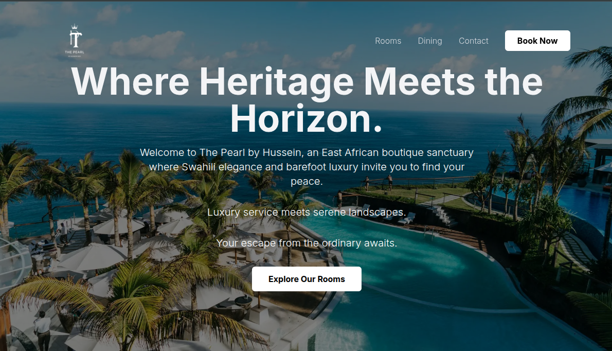

# 🏨 The Pearl Boutique Hotel - Portfolio Project

A responsive, animated website for a luxury hotel, built with Next.js, TypeScript, and Framer Motion to showcase modern front-end development skills.



---

## ✨ Features

- **Fully Responsive Design:** A sleek, modern interface that looks beautiful on all devices, from mobile phones to desktop screens.
- **Permanent Dark Theme:** A premium, elegant "sleek black" aesthetic with thin, readable fonts.
- **Rich Animations & Transitions:** Built with **Framer Motion** to create a fluid and engaging user experience, including:
  - On-load animations for the hero text.
  - Staggered, on-scroll animations for all page sections.
  - Interactive hover effects on room cards and gallery images.
  - An animated, slide-down mobile navigation menu.
- **Multi-Page Architecture:** A complete, navigable website with dedicated pages for Rooms, Dining, and Contact.
- **Reusable Components:** Built with a modular architecture, featuring reusable components like `Navbar`, `Footer`, `PageHeader`, `RoomCard`, and `Accordion`.
- **Interactive Gallery:** An immersive, full-screen image lightbox for the photo gallery.

---

## 🛠️ Tech Stack

- **Framework:** [Next.js](https://nextjs.org/) 14 (App Router)
- **Language:** [TypeScript](https://www.typescriptlang.org/)
- **Styling:** [Tailwind CSS](https://tailwindcss.com/)
- **Animation:** [Framer Motion](https://www.framer.com/motion/)
- **Icons:** [Lucide React](https://lucide.dev/)
- **Image Lightbox:** [Yet Another React Lightbox](https://yet-another-react-lightbox.com/)

---

## 🚀 Getting Started

To run this project locally:

1. **Clone the repository:**
   ```bash
   git clone https://github.com/Hussein-Sonamreel/the-pearl-hotel-portfolio.git
   ```

2. **Navigate to the project directory:**
   ```bash
   cd the-pearl-hotel-portfolio
   ```

3. **Install dependencies:**
   ```bash
   npm install
   ```

4. **Run the development server:**
   ```bash
   npm run dev
   ```

Open [http://localhost:3000](http://localhost:3000) with your browser to see the result.

---

## 👨‍💻 Developed by

**Hussein Salim**

- **GitHub:** [@Hussein-Sonamreel](https://github.com/Hussein-Sonamreel)

